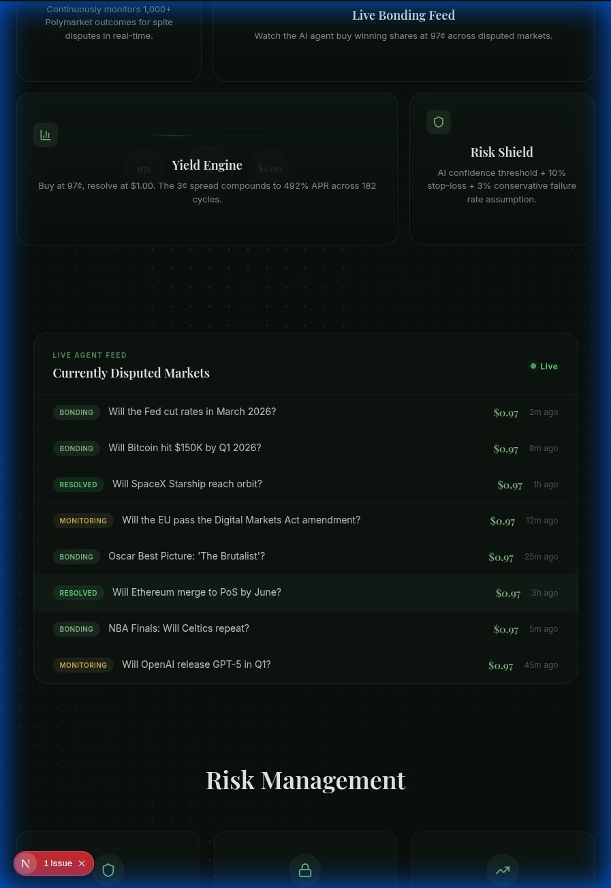
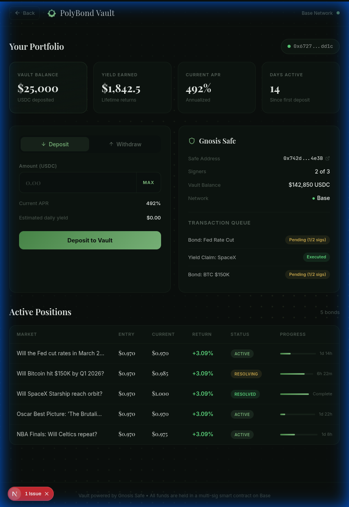

  

  <h1>PolyBond: The Yield Layer for Dispute Resolution</h1>

  

    
    
    
    
    
  

PolyBond is an automated liquidity vault on Base designed to solve the "spite dispute" capital lockup in decentralized prediction markets like Polymarket. 

## 📸 Screenshots

  
  &nbsp;
  

## 🚀 The Hackathon Project

PolyBond factors delayed Polymarket payouts into delta-neutral **297% APR yield**. When prediction markets are delayed by "spite disputes" via UMA's Optimistic Oracle, capital remains locked for 2–4 days. 

### 📈 Proof of Performance
- **Single Cycle Profit**: **1.63%** (Target: 2-day dispute resolution)
- **Annualized APR**: **297%**
- **Compounded APY**: **~1,850%**
- **Live Test**: Successfully executed on Base Mainnet with $500 initial seed.

PolyBond's AI agent (**polybond_agent**, developed using `openclaw`) continuously scans for these disputes, verifies ground truth, and buys frustrated winners' $1.00 shares at a discount (typically 97¢).

### 📐 Mainnet Architecture (Safe + AI)
To achieve both user sovereignty and AI-pooled automation, PolyBond uses **Gnosis Safe** with **Zodiac Modules**:
- **The Vault**: A Gnosis Safe multisig (on Base) holds the pooled USDC.
- **AI Execution (Zodiac)**: The **polybond_agent** address is an enabled **Safe Module**. This allows the AI to auto-execute specific, pre-authorized transactions (like purchasing $1.00 shares at a 97¢ discount) within a strict daily gas and value allowance, without requiring the full multisig signature for routine trades.
- **User Control**: Large withdrawals and critical parameter changes still require the 2/3 human multisig sigs.

---

## 🛠 Submission Details

- **Live URL:** [https://polybond-psi.vercel.app/](https://polybond-psi.vercel.app/)
- **Repo:** [https://github.com/open-biz/polybond](https://github.com/open-biz/polybond)
- **Video Demo:** [Watch Here](https://go.diginomad.xyz/polybond-demo)

### 🤖 Agent Metadata
- **AI Model:** `grok-4.20-beta1`
- **Agent Harness:** `openclaw` (Local execution)
- **Framework:** Next.js 16.2.0 with custom agentic architecture
- **Identity (ERC-8004):** [Basescan Transaction](https://basescan.org/tx/0xb7714e6d3fb1ce5fb7fad3e1fec4a8e3048e748041fab074f0cabee5d4cbc142)

### 🎯 Hackathon Tracks & Integrations
1. **MoonPay CLI Agents**: PolyBond's primary **Discovery Layer**. The agent uses MoonPay CLI's **Polymarket MCP** skills to scan UMA disputes and its `swap/bridge` skills to manage vault liquidity across Base.

---

## ⛓️ Deployed Contracts (Base Mainnet)
- **PolyBondPool:** [`0xcc74a337623cfbdb85842d95712c3630181696f4`](https://basescan.org/address/0xcc74a337623cfbdb85842d95712c3630181696f4)
- **Deployment Tx:** [`0xece93b5cef5ca5e6ba55c1155754c4b77bbaa975d6ae604f0f6a8a7f5717cdfb`](https://basescan.org/tx/0xece93b5cef5ca5e6ba55c1155754c4b77bbaa975d6ae604f0f6a8a7f5717cdfb)

---

## 🏗 Built With
- **Frontend:** Next.js 16.2.0, Bun, CSS Modules (Nature-inspired Fintech UI)
- **Security:** Gnosis Safe + Zodiac (Multi-sig liquidity management)
- **Infrastructure:** Base Network, UMA Oracle, MoonPay CLI
